# ERC-20 Token implementing methods for Hashed Time-Lock transactions on Hyperledger Fabric

## Table of contents

- [Description](#description)
- [Pre-requisites](#pre-requisites)
- [Hyperledger Fabric network](#hyperledger-fabric-network)
- [Run](#run)
    - [Deploy the network](#deploy-the-network)
      - [Manually test the chaincode](#manually-test-the-chaincode)
    - [Web Application](#web-application)
      - [Installation](#installation)
      - [Running the app](#running-the-app)
        - [Fabric CA user creation](#fabric-ca-user-creation)
        - [Transactions](#transactions)
    - [Firefly fabconnect](#firefly-fabconnect)
      - [Steps](#steps)

## Description

This project has been developed using **Hyperledger Fabric** private blockchain. The blockchain has only one organization and the network topology can be seen in the image below.
In addition, a REST API developed in **Nest.js** is available that allows connecting to the blockchain through the **Fabric SDK**, registering and enrolling a user through the **Fabric CA**, and making invocations and queries to the blockchain.

**Hyperledger Firefly fabconnect** can be connected to the blockchain using the configuration file that is available in the project.

Along with the blockchain, an **ERC20-token Smart Contract** is deployed which implements **Hash TimeLock (HTLC)** functions, those functions allow transfers to be blocked until the requirements are met, thus achieving atomic swaps.

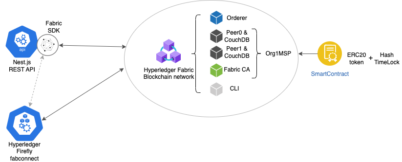

## Pre-requisites

1. Hyperledger Fabric v2.4
1. Hyperledger Fabric CA v1.5
1. Docker v20.10
1. Docker-Compose v2.14.0
1. Golang v1.19.4
1. NodeJS / TypeScript v16.13.0
1. npm v9.2.0

> Note: This has been developed using macOS, other OS have not been tested.

## Hyperledger Fabric network

The Hyperledger Fabric network consists of: 
* One orderer
    * orderer.example.com
* One organization
    * MSPID: Org1MSP
    * Two peers:
        * peer0.org1.example.com
        * peer1.org1.example.com
    * One CouchDB state database deployment for each peer
    * Fabric CA
        * ca.org1.example.com 
* Fabric CLI

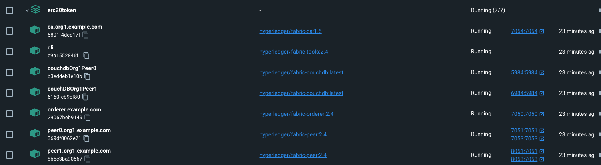


## Run

### Deploy the network

1. Install Hyperledger Fabric latest docker images and binaries.
    ```shell
    ./install-fabric.sh
    ```
    this will generate a `fabric-samples` folder inside the project directory.
    > Note: The `fabric-samples` folder is not needed, as we will only be using the downloaded Docker images to deploy the network

1. Generate the network artifacts.
    ```shell
    cd network-files
    ./generate.sh
    ```
    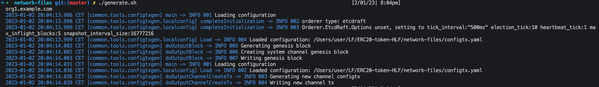

1. Deploy the network.
    ```shell
    ./start.sh
    ```
    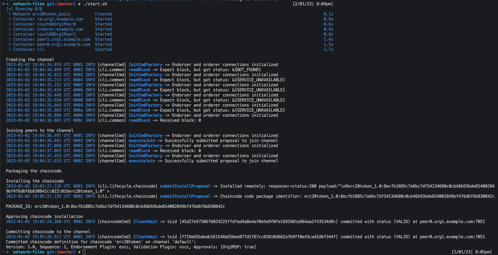

1. Teardown the network
    ```shell
    ./teardown.sh
    ```
    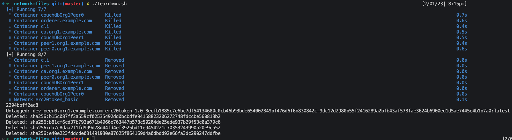

#### Manually test the chaincode

The ERC-20 token chaincode can be tested making use of the CLI Docker container.
In order to do so, get a shell inside the container:
```shell
docker exec -it cli bash
```
Once inside, some transactions can be submitted using the `peer chaincode` command. Note that this chaincode **needs to be initialized**, therefore the `Initialize` function must be executed first.

1. Initialize
    ```shell
    peer chaincode invoke -o orderer.example.com:7050 --tls --cafile $ORDERER_TLS_CA -C default -n erc20token --peerAddresses $CORE_PEER_ADDRESS --tlsRootCertFiles $CORE_PEER_TLS_ROOTCERT_FILE -c '{"function":"Initialize","args":["mytoken",  "mysymbol", "2"]}' --waitForEvent
    ```
    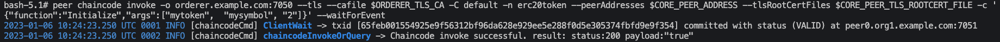

1. Mint some tokens
    ```shell
    peer chaincode invoke -o orderer.example.com:7050 --tls --cafile $ORDERER_TLS_CA -C default -n erc20token --peerAddresses $CORE_PEER_ADDRESS --tlsRootCertFiles $CORE_PEER_TLS_ROOTCERT_FILE -c '{"function":"Mint","args":["5000"]}' --waitForEvent
    ```
    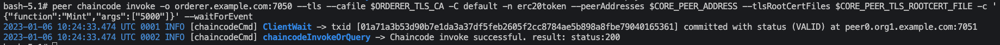

1. Query the account balance
    ```shell
    peer chaincode query -C default -n erc20token -c '{"function":"ClientAccountBalance","Args":[]}'

    ```
    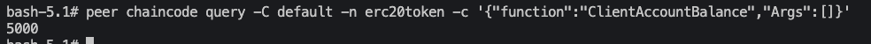

### Web Application

A Web Application is made available using **Nest.js**

```shell
cd webapp/
```

#### Installation

```shell
npm install
```

#### Running the app

```shell
npm start
```
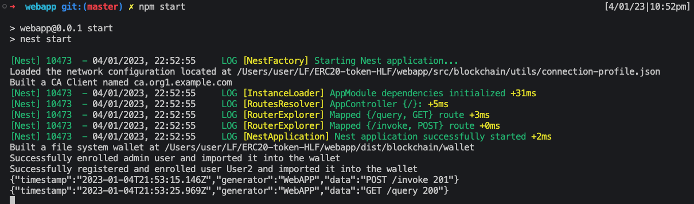

#### Using the Web Application

##### Fabric CA user creation
Whenever the web application is started, the user for the application is registered and enrolled on the Fabric CA making use of the Fabric SDK.
The configuration is specified in `webapp/src/blockchain/fabric.ts`. That being the user ID, the channel and chainode names to connect to and the path in which the wallet of the user will be generated.

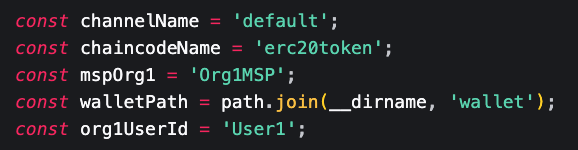

##### Transactions

Transactions can be submitted via the web application. The Nest.js webapp supports both invokes and queries to the blockchain.

The application listens on `localhost:3000` and has two endpoints:

* http://localhost:3000/invoke

  body:
  ```json
  {
      "function": "FunctionName",
      "args": ["list", "of", "arguments"]
  }
  ```

As mentioned before, this chaincode needs to be initialized in order to use it. Therefore, the `Initialize` function can be called via POSTMAN.
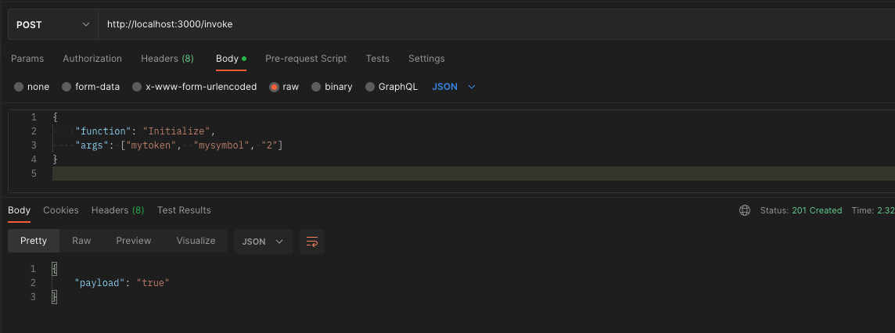

Furthermore, an `Invoke` can be made via POSTMAN to Mint some tokens
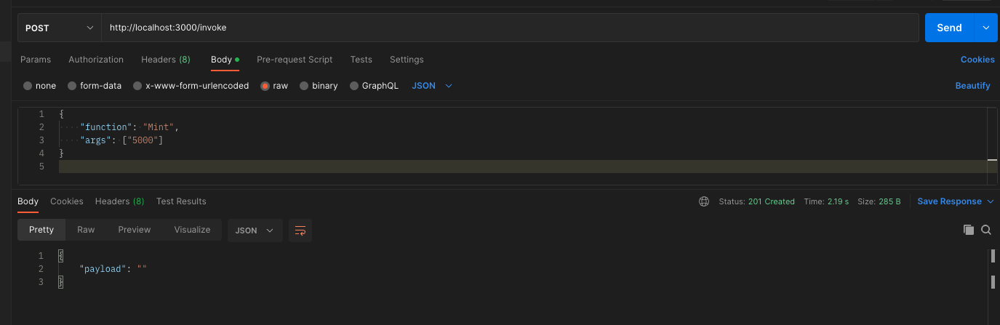

* http://localhost:3000/query

  body:
  ```json
  {
      "function": "FunctionName",
      "args": ["list", "of", "arguments"]
  }
  ```
  Similarly, a `Query` can be made via POSTMAN to get the account balance
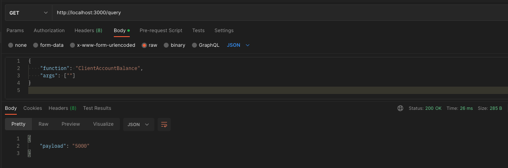

### Firefly fabconnect

Firefly fabconnect is a reliable REST and websocket API to interact with a Fabric network and stream events.

See: https://github.com/hyperledger/firefly-fabconnect

Firefly fabconnect can be connected to the network and used to interact with it.

#### Steps:

1. Pull the firefly-fabconnect repository
    ```shell
    git pull https://github.com/hyperledger/firefly-fabconnect.git
    ```
1. Go into the folder and run `make`
    ```shell
    cd firefly-fabconnect
    make
    ```
1. Firefly fabconnect needs 2 configuration files: `firefily-fabconnect-config.json` with all the Firefly configuration, and `connection-profile.json` with the Hyperledger Fabric blockchain network configuration.
    `firefly-fabconnect-config.json` can be found inside the `firefly-fabconnect/` folder of this repository.
    `connection-profile.json` is the one used by the Nest.JS WebAPP (fabric SDK) to connect to the blockchain.

    Launch the connector:
    ```shell
    ./fabconnect -f ${PWD}/firefly-fabconnect/firefly-fabconnect-config.json
    ```

    Additionally, here is the `firefly-fabconnect-config.json` file's content:

    ```json
    {
      "maxInFlight": 10,
      "maxTXWaitTime": 60,
      "sendConcurrency": 25,
      "receipts": {
        "maxDocs": 1000,
        "queryLimit": 100,
        "retryInitialDelay": 5,
        "retryTimeout": 30,
        "leveldb": {
          "path": "./receipts"
        }
      },
      "events": {
        "webhooksAllowPrivateIPs": true,
        "leveldb": {
          "path": "./events"
        }
      },
      "http": {
        "port": 3000
      },
      "rpc": {
        "useGatewayClient": true,
        "configPath": "../webapp/src/blockchain/utils/connection-profile.json"
      }
    }
    ```
